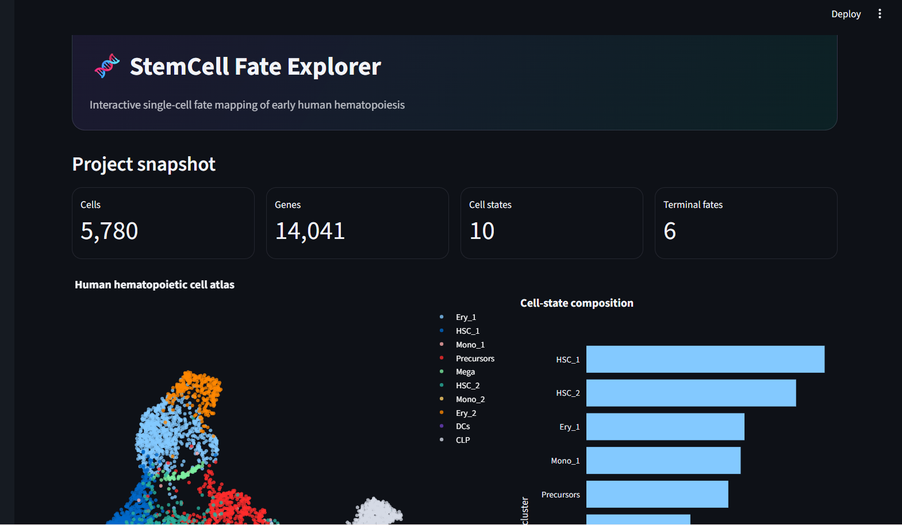
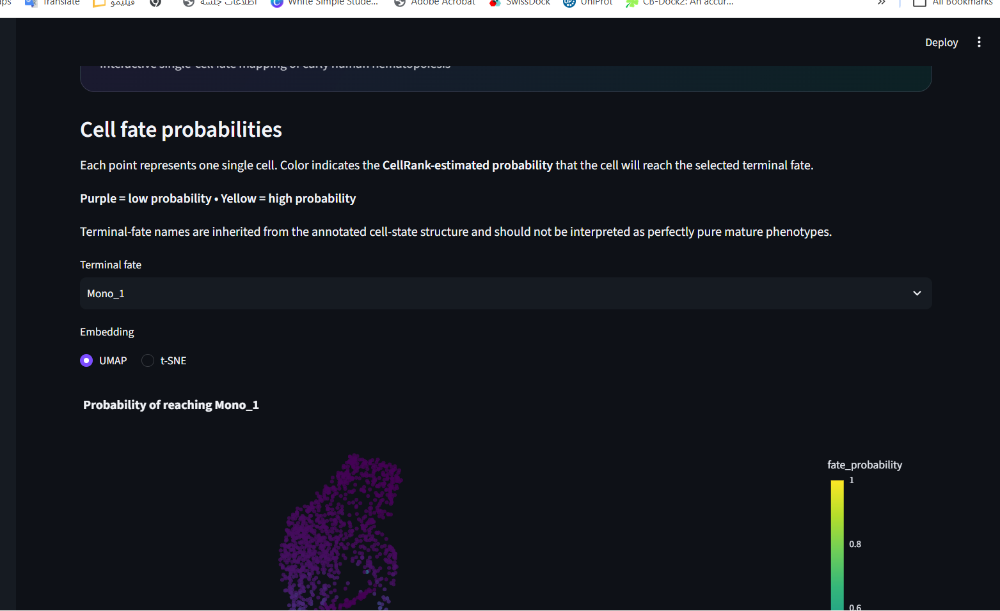
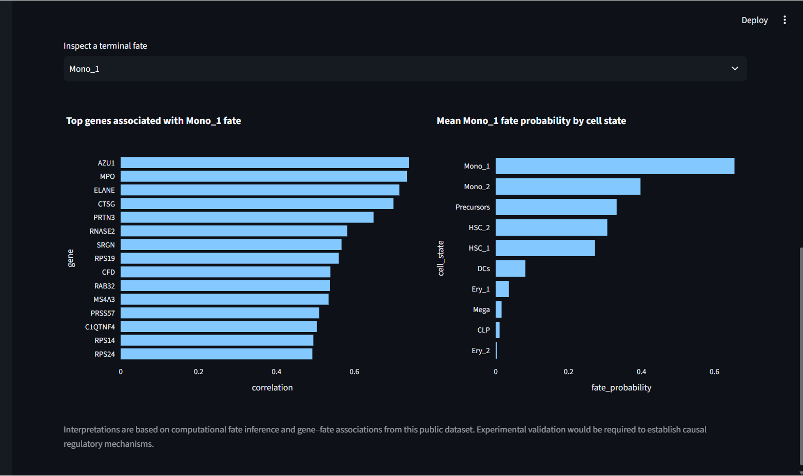

# 🧬 StemCell Fate Explorer

**Interactive single-cell fate mapping of early human hematopoiesis**  
A reproducible bioinformatics portfolio project focused on stem-cell differentiation, lineage-fate inference, and scientific visualization.

[](https://stemcell-fate-explorer-ga7tintmqwwbt8rghe5dqb.streamlit.app/)
[](https://www.python.org/)
[](https://cellrank.readthedocs.io/)
[](https://scanpy.readthedocs.io/)
[](https://streamlit.io/)
[](https://github.com/rezang-1378/stemcell-fate-explorer/actions/workflows/python-ci.yml)

## 🚀 Live Demo

**Interactive dashboard:** https://stemcell-fate-explorer-ga7tintmqwwbt8rghe5dqb.streamlit.app/



## Scientific question

How do early human hematopoietic cells progress from progenitor states toward distinct terminal fates, and which genes are most strongly associated with those fate decisions?

This project applies a directional Markov-chain model to public human CD34+ bone-marrow single-cell RNA-seq data. Palantir pseudotime is used to construct a CellRank `PseudotimeKernel`, while `GPCCA` is used to infer stable macrostates, terminal states, and cell-level fate probabilities.

The project is intended as a **research and bioinformatics portfolio application**, not a clinical decision-support system.

## Dataset

The analysis uses the public **CellRank early human hematopoiesis** dataset:

- **Biological material:** human CD34+ bone-marrow cells
- **Technology:** single-cell RNA sequencing
- **Cells analyzed:** 5,780
- **Genes in source dataset:** 27,876
- **Genes retained after filtering:** 14,041
- **Annotated cell states:** 10
- **Inferred terminal fates:** 6
- **Pseudotime:** precomputed Palantir pseudotime

The large source `.h5ad` file is downloaded locally by the analysis script and is not stored in this repository.

## Dashboard

The Streamlit application contains seven interactive views:

1. **Overview** — project metrics, cell atlas, cell-state composition, and data provenance.
2. **Cell Atlas** — UMAP/t-SNE colored by cell state, pseudotime, or differentiation potential.
3. **Fate Map** — cell-level probability of reaching each inferred terminal fate.
4. **Putative Drivers** — genes ranked by association with lineage-fate probability, with downloadable CSV results.
5. **Gene Explorer** — marker-gene expression on the cell atlas and across pseudotime.
6. **Biological Insights** — interpretable lineage signatures and fate-specific molecular patterns.
7. **Methods** — workflow, package versions, assumptions, limitations, and reproducibility details.

### Fate probability explorer



### Biological interpretation



## Biological QC highlights

The inferred states and gene–fate associations show coherent lineage signatures:

- **Erythroid (`Ery_2`)** — strong associations with `KLF1`, `ANK1`, `CA1`, `AHSP`, `SMIM1`, and `TFR2`.
- **Megakaryocytic (`Mega`)** — `GP9`, `VWF`, `CLEC1B`, `PF4`, `GP6`, and `ITGA2B`.
- **Lymphoid (`CLP`)** — `VPREB1`, `VPREB3`, `CD79A`, `CD79B`, `DNTT`, and `EBF1`.
- **Dendritic (`DCs_1`)** — `LILRA4`, `JCHAIN`, `IRF7`, `SPIB`, and `IRF8`.
- **`Mono_1` annotation** — strong `AZU1`, `MPO`, `ELANE`, `CTSG`, and `PRTN3` signal, consistent with a granulocytic/myeloid differentiation program and illustrating why computational labels should be interpreted together with molecular signatures.

All exported fate probabilities passed numerical QC for the expected `[0, 1]` range.

## Architecture

```text
Public human CD34+ bone-marrow scRNA-seq
                    │
                    ▼
             Scanpy preprocessing
 filter → normalize → log1p → HVGs → PCA → kNN → UMAP
                    │
                    ▼
             Palantir pseudotime
                    │
                    ▼
        CellRank PseudotimeKernel
                    │
                    ▼
           GPCCA / macrostates
                    │
                    ▼
             Terminal states
                    │
          ┌─────────┴─────────┐
          ▼                   ▼
   Fate probabilities   Putative drivers
          │                   │
          └─────────┬─────────┘
                    ▼
       Lightweight processed outputs
                    │
                    ▼
           Streamlit + Plotly
```

## Repository structure

```text
stemcell-fate-explorer/
├── app.py
├── assets/
│   ├── overview.png
│   ├── fate-map.png
│   └── biological-insights.png
├── data/
│   ├── README.md
│   └── processed/
├── docs/
│   └── scientific_scope.md
├── scripts/
│   └── prepare_data.py
├── src/
├── tests/
├── requirements.txt
├── requirements-analysis.txt
├── Makefile
└── .github/workflows/python-ci.yml
```

## Quick start

### Run the dashboard directly

The repository contains lightweight processed outputs so the dashboard can be launched without recomputing CellRank:

```bash
python3.12 -m venv .venv
source .venv/bin/activate
python -m pip install -r requirements.txt
python -m streamlit run app.py
```

Then open:

```text
http://localhost:8501
```

### Reproduce the scientific analysis

To regenerate the processed outputs from the public dataset:

```bash
python3.12 -m venv .venv
source .venv/bin/activate
python -m pip install -r requirements-analysis.txt
python scripts/prepare_data.py
```

The first run downloads the public CellRank source dataset to `data/raw/`.

## Reproducibility

Reference versions for this portfolio build:

- Python `3.12+`
- CellRank `2.3.2`
- Scanpy `1.12.4`

The pipeline records package versions and key analysis parameters in:

```text
data/processed/project_meta.json
```

A GitHub Actions workflow performs repository syntax/schema checks on pushes and pull requests.

## Data policy

- `data/raw/` and `.h5ad` source files are excluded from Git.
- The lightweight `data/processed/` outputs required by the Streamlit dashboard are tracked in the repository.
- Scientific results are generated from the real public dataset; the application does not fabricate placeholder biological results when outputs are missing.

## Scientific limitations

Fate probabilities are model-derived quantities under the selected transition model and pseudotime representation.

The **Putative Drivers** view ranks genes by association with fate probabilities. These associations should **not** be interpreted as proof of causal regulation. Experimental validation would be required to establish regulatory mechanisms.

Cell-state labels inherited from the dataset are also interpreted together with molecular signatures rather than treated as perfectly pure mature-cell identities.

## References

- CellRank documentation: https://cellrank.readthedocs.io/
- CellRank human bone-marrow tutorial: https://cellrank.readthedocs.io/en/stable/notebooks/tutorials/general/100_getting_started.html
- Setty et al. (2019), *Nature Biotechnology* — Palantir characterization of human hematopoiesis.
- Lange et al. (2022), *Nature Methods* — CellRank fate mapping.

## Author

**Reza Negahban**  
Bioinformatics / Computational Biology portfolio project.

## License

Code is released under the MIT License. The public dataset and upstream software retain their original licenses and citation requirements.
